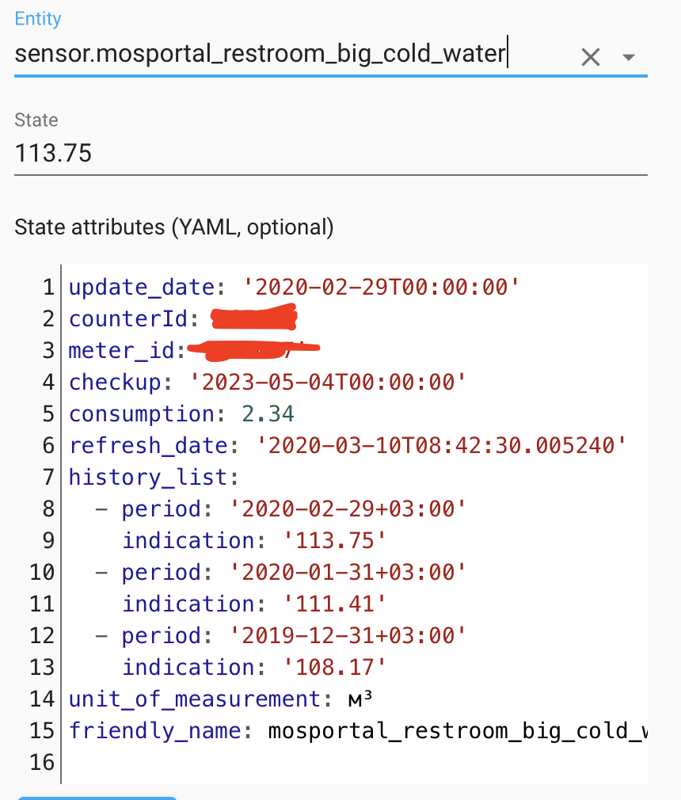
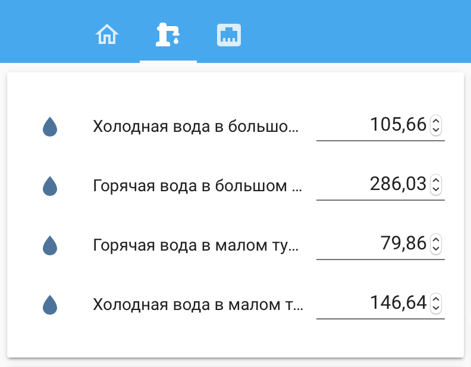
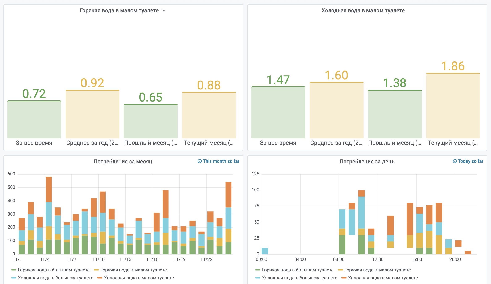

# home_assistant компоненты для работы с порталом Москвы и Мосэнергосбыт (https://www.mos.ru)

Компонент для работы с сервисами моспортала:
1. получение pdf файла ЕПД
2. передача данных расхода воды. Есть поддержка нескольких счетчиков воды

**Инструкции**
1. Клонировать репозиторий [https://github.com/kkuryshev/ha_mosportal.git](https://github.com/kkuryshev/ha_mosportal.git)
2. Создать при необходимости папку "custom_components" и в нее скопировать папку "mosportal" и ее содержимое.
3. Добавить следующие настройки в основной файл конфигурации HAS "configuration.yaml". 

          mosportal:
            flat: !secret mosportal_flat
            paycode: !secret mosportal_paycode
            username: !secret mosportal_login
            password: !secret mosportal_passwd

4. Компонент автоматически добавит сенсоры (по одному на каждый счетчик, зарегистрированный в ЛК на портале Москвы). 
   * По умолчанию название счетчика берется из его номера. При желании, название сенсора можно переименовать в Home_assistant (HASS)
   * Счетчики можно так же отключить (в настройках HASS). 
   * Автоматическое получения данных с портала для счетчиков отключено. Обновить состояние можно вручную, вызвав для этого стандартный сервис HAS homeassistant.update_entity и указав в входных данных entity_id = названию сенсора. 
  

5. Для передачи показаний нужно воспользоваться сервисом **mosportal.publish_water_usage**. 
    * На вход передается массив из показаний (если счетчиков несколько) согласно примеру ниже:
   
          - service: mosportal.publish_water_usage
            data_template:
              meter_list_to_update:
                - meter_id: # (номер счетчика, можно использовать !secret meter_1_paycode)
                  value: # (текущие показания счетчика, например {{states('input_number.meter_1')}})
                  friendly_name: # (наименование счетчика для последующего отображения в event, например 'Счетчик холодной воды')                    
                  ...
                - meter_id:
                  value:
                  friendly_name: 

    * Можно так же настроить задачу для автоматической отправки:
  
          - alias: Send meters value to mosportal
              trigger:
                  - platform: time
                    at: '12:00:00'
              condition:
                  - condition: template
                    value_template: "{{ now().day == 20 }}"
              action:
                  - service: mosportal.publish_water_usage  #сервис, который публикует компонент 

    * При передаче показаний генерируются следующие события  (event):
      * Для каждого счетчика, если передача была успешно генерируется событие (event) с типом **upload_water_success**. Содержит событие json: {friendly_name:str,meter_id:str,usage:str}
      * Для кадлого счетчкиа, если передача была не успешна генерируется событие (event) с типом **upload_water_fail**. Содержит событие json: {friendly_name:str,meter_id:str,error:str}
      * Один раз после обновления вне зависимости от успешности передачи генерируюется событие **upload_water_finish**. Тело пустое. На него можно, например, повесить обновление данных с портала:

            - alias: 'mosportal_upload_water_usage_finish'
              trigger:
                - platform: event
                  event_type: upload_water_finish
              action:
                - service: homeassistant.update_entity
                  entity_id: sensor.meter_1
                - service: homeassistant.update_entity
                  entity_id: sensor.meter_2

                  

    * События можно использовать для любой последующей обработки, например выводить в качестве информации на экран, или обновлять статусы сенсоров портала

            - alias: 'mosportal_upload_water_usage_fail'
              trigger:
                - platform: event
                  event_type: upload_water_fail
              action:
                - service: mqtt.publish
                  data_template:
                    payload: >
                      Ошибка передачи показаний для счетчика <{{ trigger.event.data['friendly_name'] }}>
                      : {{ trigger.event.data['error'] }}
                    topic: 'HASS'
6. Для получения ЕПД нужно вызвать сервис **mosportal.get_epd**
   * На вход могут быть переданы необязательные параметры:
     * year - год получения ЕПД
     * month - месяц получения EПД
     * data - строка с сериализованным json для проксирования данных. Вся эта информация окажется в event **get_epd_success**, который будет сгенерирован при выполнении сервиса
     * В случае, если сервис отработал успешно, будет сгенерировано событие **get_epd_success**, которое будет содержать json следующего формата: {msg: строка, content: base64 с pdf епд, filename: название файла, ... а так же все атрибуты, которые были переданы в входном парамертре data}
     * В случае, если сервис отработал с ошибой, будет сгенерировано событие **get_epd_error**, которое будет содержать json следующего формата: {msg:строка с ошибкой}

7. Для более корректной работы, компонент сохраняет куки в корневой папке has/.storage/.mosportal_cookie
   
**Пример полной автоматизации от получения данных от счетчика до передачи показаний на портал Москвы**
1. К герконам водяных счетчиков подключены микроконтроллеры, которые регистрируют импульсы (по два на каждые 10 литров воды - один логическая 1 и один логический 0). 
2. На каждый импульс генерируется сообщение, которое отправляется в mqtt топик, который слушает HomeAssistant (HA)
3. Для каждого счеткика в HA создан сенсор для регистрации импульса (Сами значения хранятся в influxdb для будущей аналитики в Grafana):
  
        - platform: mqtt
          name: "small_restroom_water_cold"
          availability_topic: "sh/restroom/small/water/availability"
          state_topic: "sh/restroom/small/water/cold/pulse"
          value_template: "{{ value_json.pulse | int }}"
          unit_of_measurement: "Pulses"

4. В HA созданы input_number для каждого счетчика для хранения актуального значения:
  
        big_restroom_water_cold_control_val:
            name: big_restroom_water_cold
            unit_of_measurement: m3
            step: 0.001
            min: 0
            max: 9999
            mode: box

5. Так же HA созданы правила (по одному для каждого счетчика), которое добавляет 10 литров воды к input_number. Важно, что фиксируем только импульсы с логической 1, так как из топика mqtt приходит два импульса. Это связано с необходимостью смены состояния сенсора, иначе не будет вызываться триггер:
  
        - alias: incriment small_restroom_water_cold
            trigger:
                - platform: numeric_state
                  entity_id: sensor.small_restroom_water_cold
                  value_template: "{{ states.sensor.small_restroom_water_cold.state | int }}"
                  above: 1
                  below: 11
            action:
                - service: input_number.set_value
                  data_template:
                    entity_id: input_number.small_restroom_water_cold_control_val
                    value: '{{ (states.input_number.small_restroom_water_cold_control_val.state | float + 0.01) | round(2) }}'

Такой подход позволяет имеет следующие преимущества:
1. В HA хранятся актуальные значения данных (легко сверить/отредактировать в случае необходимости):

2. Сами импульсы хранятся в influxdb с временной меткой, что позволяет сделать информативные отчеты:
